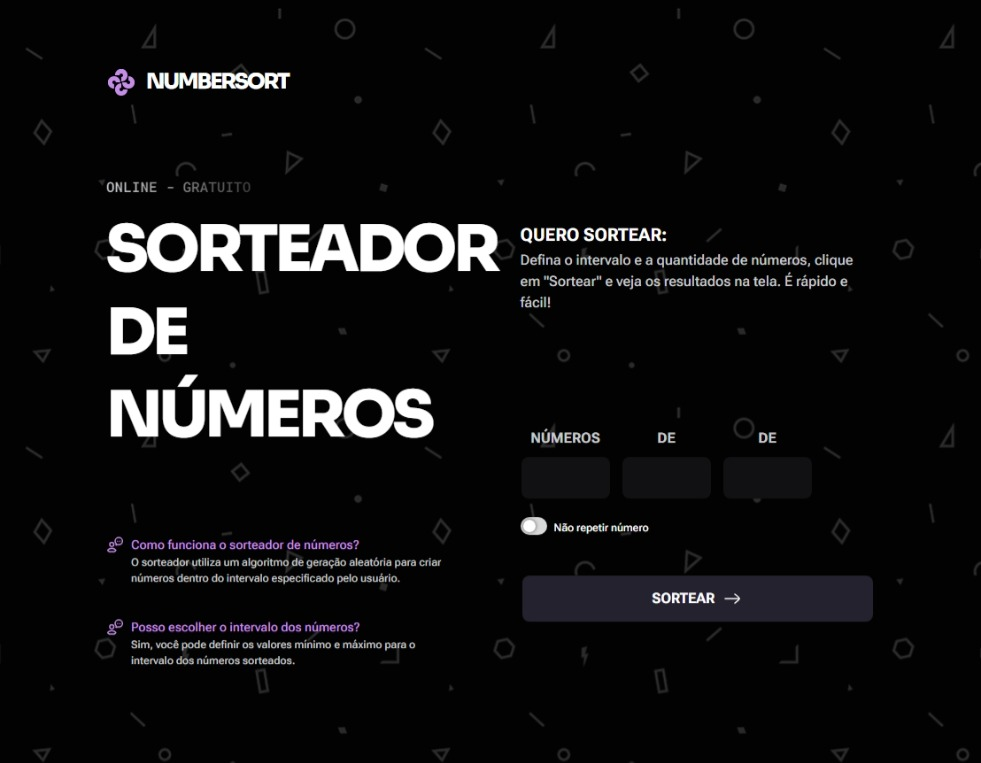
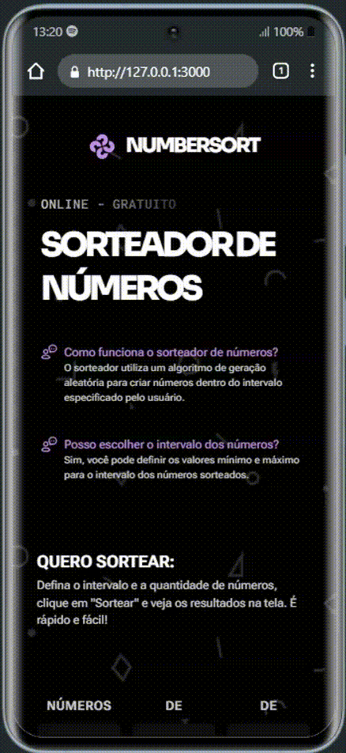
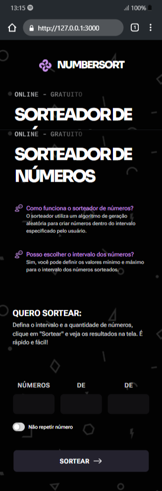

<h1 align="center">NumberSort</h1>

  **NumberSort** é um projeto de desafio do curso <a href="https://app.rocketseat.com.br/journey/full-stack/overview" target="_blank" rel="noopener noreferrer">Full-Stack da RocketSeat</a> onde construimos uma página com funcionalidade de JavaScript. O desafio incentiva o aluno a se esforçar sozinho para construir o projeto.

  
  
  
  
  

 <a href="#objective">Objective</a> •
 <a href="#features">Features</a> • 
 <a href="#instalation">Instalation</a> • 
 <a href="#demonstration">Demonstration</a> • 
 <a href="#technology">Technology</a> • 
 <a href="#autor">Autor</a>

## 🎯 Objective
O objetivo do desafio é construir uma página funcional de randomização de números com JavaScript. Eu resolvi implementar algumas **Features** a mais para deixar mais completo o projeto.

## 🔧 Features
- [x] Todo o CSS foi feito com <a href="https://developer.mozilla.org/en-US/docs/Web/CSS/CSS_nesting/Using_CSS_nesting" target="_blank" rel="noopener noreferrer" alt="Link para a documentação sobre CSS Nesting">CSS Nesting</a>
- [ ] Mobile até 390px

## ⚒️ Instalation
- Clone repository:
  - Using CLI: `gh repo clone duhnunes/ListaDeCompras`
  - Using GIT: `git clone https://github.com/duhnunes/ListaDeCompras.git`
- Open in VSCode:
  - Type `code ListaDeCompras`
  - or Go to folder `cd ListaDeCompras` and type `code .`
- Open in Browser:
  - Double Click `index.html` file

## 📺 Demonstration
### 1920x1080

  
  

### 390p

  
  

## 💻 Technology
- HTML
- CSS
- JavaScript

## 🧔 Author

  

 
Sou um cara simples que gosta de criar layouts de FrontEnd e estou em constante evolução para me tornar um Dev Fullstack através de boas práticas para ter um código mais organizado, bonito e mais seguro.  
 
As vezes também gosto de ir ao meu Codepen e fazer alguma coisa com CSS puro. Dá uma conferida lá 👇😉  

 

